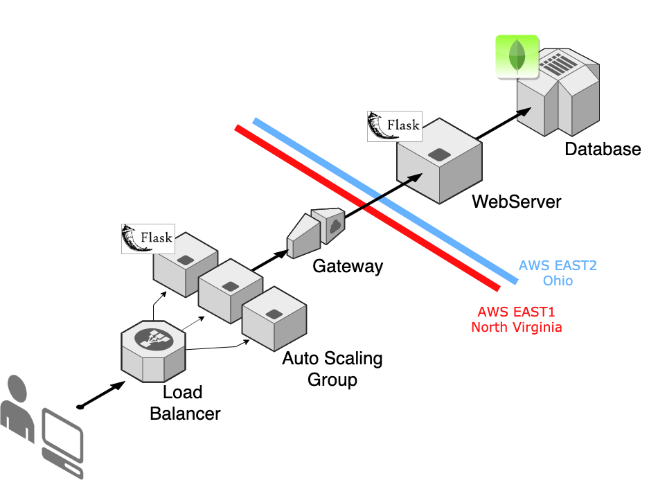

# CloudCreator

## Model


## Configure AWS
``` 
$ aws configure 
```
## Edit Config.py
You can edit the config.py file; otherwise, the names displayed on instances, securitygroups, loadbalances, etc. will be named after the example config.py, which should run correctly.

## Run script
``` 
python3 main.py 
```

After finished running, it should take no longer than 5 minutes for everything to be running normally. It should create two keys. ```virginia.pem``` and ```ohio.pem```. You can use these keys to acces your instances with ssh.


### Testing
``` 
python3 tarefa.py listar
```
You can see other available commands with ``` python3 tarefa.py help ```
